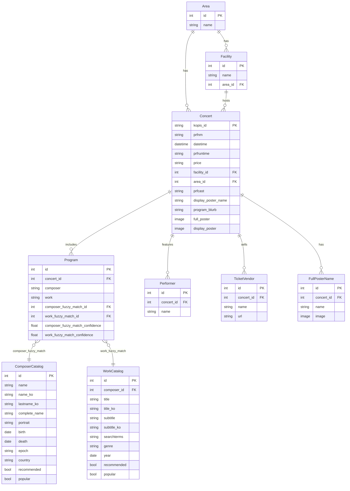

# 🎼 Classical Music Concert Search Engine

_A modern Django web app for searching and exploring classical concerts in Korea, featuring AI-powered poster reading!_

> **Why this project?**  
> Currently, there is no website in Korea where you can search for classical concerts by program (repertoire). This project was created to fill that gap and make it easy to discover concerts based on the music being performed.

**Website live at:** [https://classical-music-korea.onrender.com/concerts/](https://classical-music-korea.onrender.com/concerts/)

---

## ⚠️ Disclaimer

The concert poster reading and information extraction features use AI and automated methods. While we strive for accuracy, there may be occasional mistakes or misinterpretations in composer, work, or program details. Please double-check important information, and feel free to report any errors or suggest corrections!

> **Note:** This project is under active development and is **not production ready**.

---

## 🎵 Data Sources & AI Extraction

- **KOPIS API:**  
  This project uses the [KOPIS](https://kopis.or.kr/por/cs/openapi/openApiInfo.do?menuId=MNU_00074) public API to fetch concert metadata, including concert titles, dates, venues, and performer information for classical music events in Korea.

- **AI-Powered Program Extraction:**  
  While KOPIS provides rich metadata, it often does **not** include detailed program (repertoire) information.  
  To address this, the project uses the **OpenAI API** to:
  - Parse program details from unstructured text fields (when available).
  - Read and extract program information directly from concert poster images.

This hybrid approach ensures that users can search and browse concerts with accurate program details, even when the original data source is incomplete.

---

## 🚀 Features

- Search and browse upcoming classical music concerts in Korea
- View concert details, performers, and program information
- Display concert posters and images, securely served from AWS S3
- Randomized homepage concert selection on each visit

---

## 🛠️ Tech Stack

- **Backend:** Django, Python
- **Frontend:** Django Templates, HTML/CSS
- **Database:** SQLite
- **Media Storage:** AWS S3 (with private/proxy serving)
- **Deployment:** Render.com

---

## 📁 Project Structure

```
classical_music_korea/
├── catalog/           # Composer & work database app (WIP)
├── concert/           # Concerts app (search, results, detail)
├── concert_project/   # Django project settings
├── media/             # Uploaded concert posters from previous iteration
├── requirements.txt
├── manage.py
└── ...
```

---

## 📊 Database Diagram



---

## 📝 To-Do / Planned Features

- [ ] Add a Cron job to automatically add new concerts and delete old concerts
- [ ] Use the information in catalog to standardize the writing style of composer and composition 
- [ ] Complete translation of composer and composition into Korean 

---

## 📝 License

MIT License

---

## ✨ Acknowledgements

- [Open Opus](https://openopus.org/) for composer/work data
- [KOPIS](https://www.kopis.or.kr/) for concert data
- Django, Python, and all open-source contributors

---
